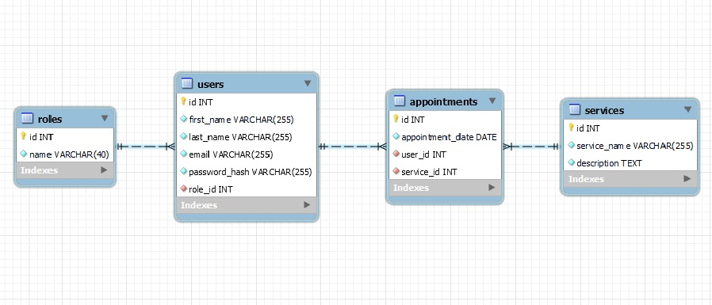
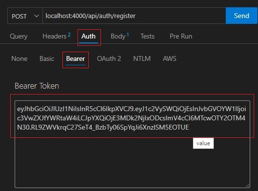
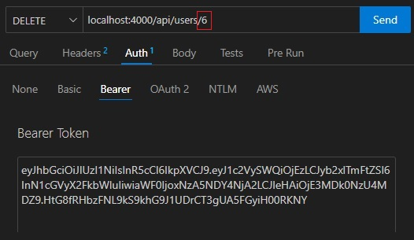

# Tattoo Studio :black_nib:
Bienvenido a la documentación de la API de mi estudio de tatuajes. Es mi cuarto proyecto dearrollado en GeeksHubs Academy en el cual se ponen en práctica habilidades de desarrollo backend con Typescript y Express.

## Tabla de contenido :page_with_curl:

- [Tecnologías.](#tecnologías)
- [Diagrama.](#diagrama-bd)
- [Instalación en local.](#instalación-en-local)
- [Usuarios modelo](#usuarios-modelo)
- [Endpoint.](#endpoints)
- [Futuras funcionalidades.](#futuras-funcionalidades)
- [Autor.](#autor)
- [Agradecimientos.](#agradecimientos)

### Tecnologías :star2:

    

### Diagrama BD :book:



### Instalación en local :gear:

**1. Clona el repositorio.**
````
$ git clone https://github.com/VictorBlasco5/Proyect_backend_1
````
**2. Instalar las dependencias.**
````
$ npm install
````
**3. Poner en marcha el servidor.**
````
$ npm run dev
````
**4. Ejecutar las migraciones.**
````
$ npm run run-migrations
````
**5. Ejecutar los seeders.**
````
$ npm run seed
````

### Usuarios modelo :pouting_face:
#### User
````
Nombre: Carles
Apellido: Clemente
Email: carles@clemente.com
Contraseña: 12345678
````
#### Admin
````
Nombre: Víctor
Apellido: Blasco
Email: victor@blasco.com
Contraseña: 12345678
````
#### Superadmin
````
Nombre: Laura
Apellido: Blasco
Email: laura@blasco.com
Contraseña: 12345678
````

### Endpoints :dart:
##### Autenticación
- `POST /api/auth/register` - **Registrar nuevo usuario.**
Pasamos los siguientes datos por el body. Ejemplo:
````
{
   "first_name": "nombre",
   "last_name": "apellido",
   "email": "email@email.com",
   "password_hash": "contraseña"
}
````

- `POST /api/auth/login` - **Inicio de sesión.**
Pasamos los siguientes datos por el body. Ejemplo:
````
{
  "email": "email@email.com",
  "password_hash": "contraseña"
}
````
##### Usuarios

- `GET /api/users` - **Ver todos los usuarios. (Solo el superadmin)**
Pasamos el token de un usuario superadmin.


- `GET /api/users/profile` - **Ver perfil de usuario.**
Pasamos el token del propio usuario.

- `PUT /api/users/profile` - **Modificar datos del perfil.**
Pasamos el token del propio usuario y los datos que queramos modificar por el body. Ejemplo:
````
{
  "first_name": "Nombre",
  "last_name": "Apellido",
  "email": "email@email.com"
}
````


- `DELETE /api/users/{id}` - **Eliminar usuario. (Solo el superadmin)**
Pasamos el token del superadmin y el id del usuario a eliminar por parámetro.


##### Citas
- `POST /api/appointments` - **Crear cita.**
Pasamos el token del usuario y los siguientes datos por el body. Ejemplo:
````
{
  "appointment_date": "2024-03-10",
  "service_id": "4"
}
````
- `PUT /api/appointments` - **Actualizar mi cita.**
Pasamos el token del usuario y por el body los datos que deseemos actualizar. Ejemplo:
````
{
  "appointment_date": "2024-04-12",
  "service_id": "3",
  "appointment_id": "5"
}
````
- `GET /api/appointments/{id}` - **Recuperar una cita.**
Pasamos por parametro el numero de id del servicio que queramos recuperar.

- `GET /api/appointments` - **Ver todas mis citas.**
Pasamos el token del usuario para ver sus citas.

##### Servicios
- `GET /api/services` - **Ver todos los servicios.**
- `POST /api/services` - **Crear un servicio. (Solo el superadmin)**
Pasamos el token del superadmin y los siguientes datos por el body. Ejemplo:
````
{
"service_name": "Personalized tattoo",
"description": "Customers will have the freedom to select unique motifs and designs, fully customizing their tattoo experience according to their preferences and tastes."
}
````
- `PUT /api/services/{id}` - **Modificar un servicio. (Solo el superadmin)**
Pasamos el token del superadmin y los datos a modificar por el body.

- `DELETE /api/services/{id}` - **Eliminar un servicio. (Solo el superadmin)**
Pasamos el token del superadmin y el id del servicio a eliminar por parametro.


### Futuras funcionalidades 	:rocket:
- Posibilidad de elegir entre distintos tatuadores.

### Autor :curly_haired_man:
- **Víctor Blasco** - Project Developer.
   - [GitHub](https://github.com/VictorBlasco5)

### Agradecimientos 
- Agradecimiento a GeeksHubs Academy por su implicación en mi aprendizaje.