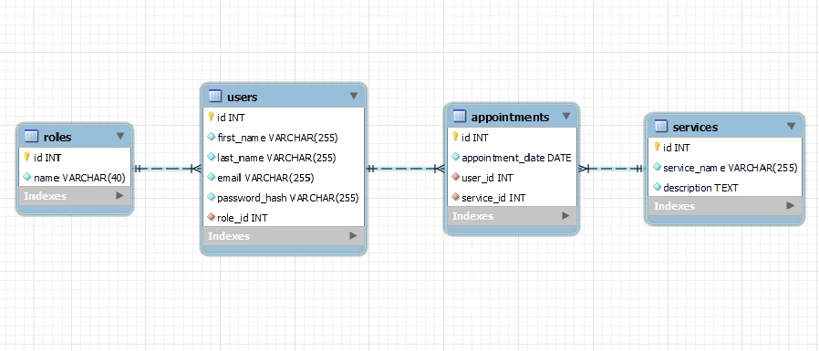

# Tattoo Studio
Bienvenido a la documentación de la API de mi estudio de tatuajes. Es mi cuarto proyecto dearrollado en GeeksHubs Academy en el cual se ponen en práctica habilidades de desarrollo backend con Typescript y Express.

## Tabla de contenido

- [Tecnologías.](#tecnologías)
- [Diagrama.](#diagrama-bd)
- [Instalación en local.](#instalación-en-local)
- [Endpoint.](#endpoints)
- [Futuras funcionalidades.](#futuras-funcionalidades)
- [Autor.](#autor)
- [Agradecimientos.](#agradecimientos)

### Tecnologías

### Diagrama BD

### Instalación en local

### Endpoints
##### Autenticación
- `POST /api/auth/register` - Registrar nuevo usuario.
- `POST /api/auth/login` - Inicio de sesión.

##### Usuarios

- `GET /api/users` - Ver todos los usuarios. **(Solo el superadmin)**
- `GET /api/users/profile` - Ver perfil de usuario.
- `PUT /api/users/profile` - Modificar datos del perfil.
- `DELETE /api/users/{id}` - Eliminar usuario. **(Solo el superadmin)**

##### Citas
- `POST /api/appointments` - Crear cita.
- `PUT /api/appointments` - Actualizar mi cita.
- `GET /api/appointments/{id}` - Recuperar una cita.
- `GET /api/appointments` - Ver todas mis citas.

##### Servicios
- `GET /api/services` - Ver todos los servicios.
- `POST /api/services` - Crear un servicio. **(Solo el superadmin)**
- `PUT /api/services/{id}` - Modificar un servicio. **(Solo el superadmin)**
- `DELETE /api/services/{id}` - Eliminar un servicio. **(Solo el superadmin)**

### Futuras funcionalidades
- Posibilidad de elegir entre distintos tatuadores.

### Autor
- **Víctor Blasco** - Project Developer.
   - [GitHub](https://github.com/VictorBlasco5)

### Agradecimientos
- Agradecimiento a GeeksHubs Academy por su implicación en mi aprendizaje.